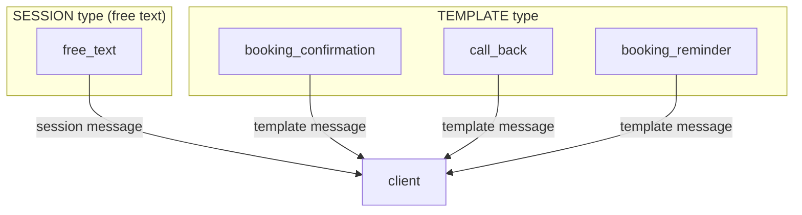

# Supermeteor
Supermeteor is PHP SDK use to create cloud message: whatsapp, sms and email etc

# How to use

## install using composer
```bash
composer require supermeteor/sdk-php
```

## include vendor/autoload.php in your file

```php
require_once '../vendor/autoload.php';
use Supermeteor\Client;

```

## Initialise the SDK object
```php
$sm = new Supermeteor('<secret_key>');
```

### 1. For sending sms:

pass type, phone, message as function parameter,
Here is the sample function call for send sms.

#### Type must be: sms

```php
$result = $sm->SendMessage('<type>', '+XXXXXXXXX', 'your message');
```
### 2. For sending email:
> **__IMPORTANT:__** Custom email sender must be preset

pass email, subject, message as function parameter,
Here is the sample function call for send email.
```php
$result = $sm->sendEmail('mail@email.com', 'subject', 'your message');
```

### 3. For sending a simple whatsapp message:

pass free message as function parameter,
Here is the sample function call for send whatsapp.
```php
$fromPhone = '+852 6444 4444'
$toPhone = '+852 6888 8888'
$result = $sm->sendWhatsapp($fromPhone, $toPhone, 'your message');
```

# Whatsapp template message

## Message types overview (example)


## SESSION message example
```json
{
  "fromPhone": "+852 6111 2222",
  "secret": "{{secret}}",
  "phone": "+852 6333 4444",
  "message": "free text blah blah blah..."
}
```

Code sample:
```php
$supermeteor->sendWhatsapp($fromPhone, $toPhone, 'free text blah blah blah...');
```

## Template message example
> **__IMPORTANT:__** template message must be same as predefined

### example: booking_confirmation
message pre-approved
> Hello {{1}} , this is a confirmation of your consultation on {{2}}. ⭐We are at {{3}}.⭐

```json
{
  "fromPhone": "+852 6111 2222",
  "secret": "{{secret}}",
  "phone": "+852 6333 4444",
  "message": "",
  "template": {
    "name": "booking_confirmation",
    "language": {
      "policy": "deterministic",
      "code": "en"
    },
    "components": [
      {
        "type": "body",
        "parameters": [
          {
            "type": "text",
            "text": "Krishna"
          },
          {
            "type": "text",
            "text": "2022-06-11 10:00"
          },
          {
            "type": "text",
            "text": "4214 Lynn Street, Milton, MA"
          }
        ]
      }
    ]
  }
}
```

Code sample
```php
$template = new \Supermeteor\WhatsappTemplateMessage(
    'booking_confirmation',
    'en',
    ['John', '2019-01-12']
);

// send a whatsapp template message
$supermeteor->sendWhatsapp($fromPhone, $toPhone, $template);
```

## example: call_back
message pre-approved
> Hi {{1}}, Just called you but not able to reach you, when is a good time to call backat {{2}}?

```json
{
  "fromPhone": "+852 6111 2222",
  "secret": "{{secret}}",
  "phone": "+852 6333 4444",
  "template": {
    "name": "call_back",
    "language": {
      "policy": "deterministic",
      "code": "en"
    },
    "components": [
      {
        "type": "body",
        "parameters": [
          {
            "type": "text",
            "text": "Krishna"
          },
          {
            "type": "text",
            "text": "2022-06-11 10:00"
          }
        ]
      }
    ]
  }
}
```

## example: reminder
message pre-approved

> Hello {{1}}, this is a reminder of your consultation at {{2}}. ⭐{{3}}⭐

```json
{
  "fromPhone": "+852 6111 2222",
  "secret": "{{secret}}",
  "phone": "+852 6333 4444",
  "template": {
    "name": "greeting",
    "language": {
      "policy": "deterministic",
      "code": "en"
    },
    "components": [
      {
        "type": "body",
        "parameters": [
          {
            "type": "text",
            "text": "Krishna"
          },
          {
            "type": "text",
            "text": "2022-06-11 10:00"
          },
          {
            "type": "text",
            "text": "4214 Lynn Street, Milton, MA"
          }
        ]
      }
    ]
  }
}
```